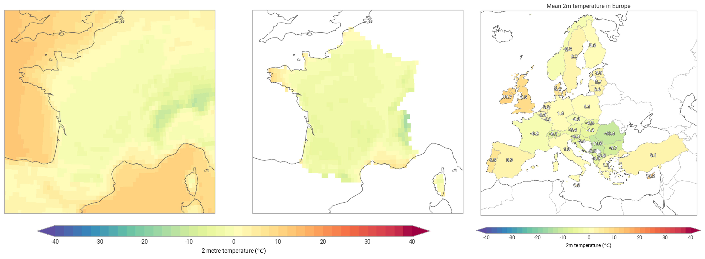

# Spatial computations

Earthkit transforms provides a `spatial` sub-package designed for computations in the
spatial domains. It combines geometry data with raster or point cloud data making
it simple to apply masks and compute aggregations with minimal inspection
of the details of the data formats.

Useful links:
- [Spatial methods and API explained](https://earthkit-transforms.readthedocs.io/en/latest/concepts/spatial.html)
- [Related tutorials](https://earthkit-transforms.readthedocs.io/en/latest/tutorials/spatial/index.html)
- [Related How-to examples](https://earthkit-transforms.readthedocs.io/en/latest/how-tos/spatial/index.html)

---
<!-- 
::::{grid} 1 1 3 3

:::{card}
:header: 
<b>Daily and monthly means</b>

:link: ./01-calculate-and-plot-daily-monthly-mean-data
Calculate and plot monthly and daily statistics from hourly ERA5 data.
:::

:::{card}
:header: 
<b>Country level aggregations</b>

:link: ./02-reduce-era5-data-over-geometries.ipynb
Calculate country level aggregations by combining gridded data with geometry data.
:::

:::{card}
:header: 
<b>Climatologies</b>

:link: ./03-calculate-and-plot-climatologies
Calculate and plot monthly climatologies of ERA5 data.
:::

::::
 -->
