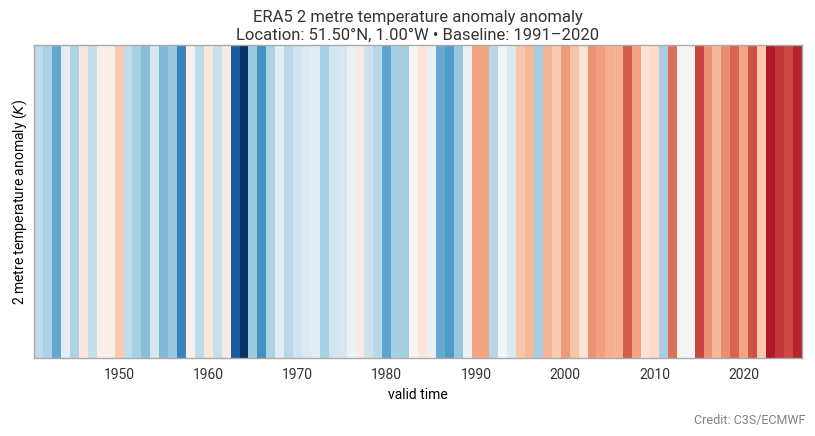

# Climatology computations

Earthkit transforms provides a `climatology` sub-package designed for computations
over climatological periods. It provides a simple, high-level API for grouping data
and computing quite complex anomalies to the use-case needs.

Useful links:
- [Climatology methods and API explained](https://earthkit-transforms.readthedocs.io/en/latest/concepts/climatology.html)
- [Related tutorials](https://earthkit-transforms.readthedocs.io/en/latest/tutorials/climatology/index.html)
- [Related How-to examples](https://earthkit-transforms.readthedocs.io/en/latest/how-tos/climatology/index.html)

---
<!-- 
::::{grid} 1 1 3 3

:::{card}
:header: 
<b>Daily and monthly means</b>

:link: ./01-calculate-and-plot-daily-monthly-mean-data
Calculate and plot monthly and daily statistics from hourly ERA5 data.
:::

:::{card}
:header: 
<b>Country level aggregations</b>

:link: ./02-reduce-era5-data-over-geometries.ipynb
Calculate country level aggregations by combining gridded data with geometry data.
:::

:::{card}
:header: 
<b>Climatologies</b>

:link: ./03-calculate-and-plot-climatologies
Calculate and plot monthly climatologies of ERA5 data.
:::

::::
 -->
